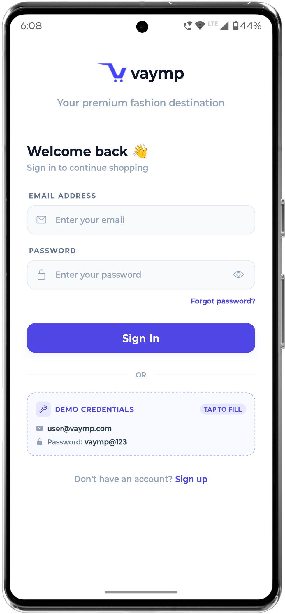
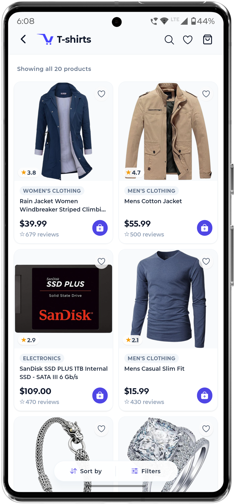
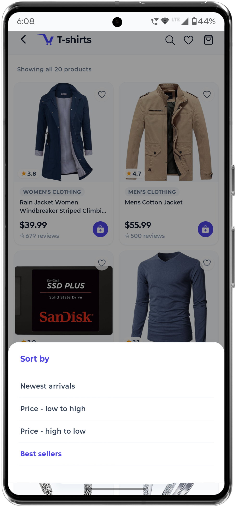
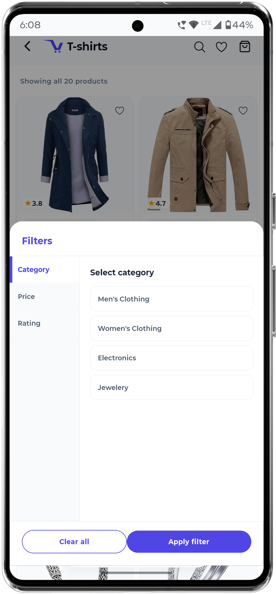
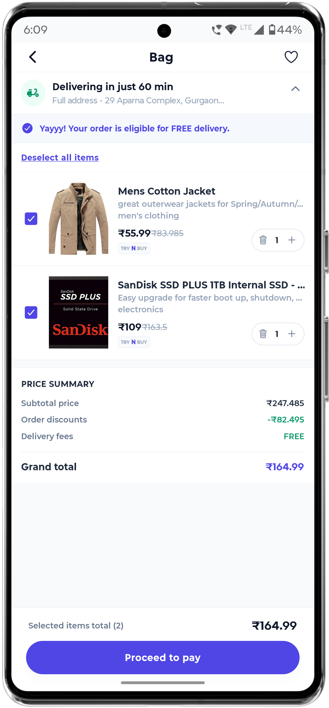
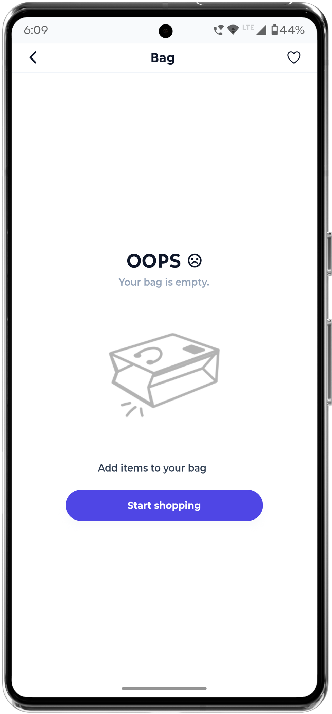

# 🛍️ VAYMP E-Commerce App

A modern React Native e-commerce application built with Expo, Redux Toolkit, and NativeWind. The application allows users to browse products, sort and filter products, manage a shopping bag, and persist cart data across app restarts.
## 📱 Screenshots

| Login Screen | Products Screen |
|--------------|----------------|
|  |  |

| Sort Bottom Sheet | Filter Bottom Sheet |
|-------------------|---------------------|
|  |  |

| Shopping Bag | Empty Bag State |
|-------------|----------------|
|  |  |
---

## 🚀 Features

### Authentication

* User Login Screen
* Form Validation
* Navigation Guard

### Products

* Fetch products from Fake Store API
* Product Listing Screen
* Product Images, Titles, Descriptions, and Prices
* Responsive Product Cards

### Sorting

* Price: Low to High
* Price: High to Low
* Rating: High to Low

### Filtering

* Category Filter
* Apply Filters
* Clear Filters

### Shopping Bag

* Add Products to Bag
* Remove Products from Bag
* Increase Quantity
* Decrease Quantity
* Grand Total Calculation
* Total Item Count

### Persistence

* Shopping Bag persists across app restarts
* Implemented using AsyncStorage + Redux Toolkit

---

## 🛠️ Tech Stack

* React Native
* Expo
* Expo Router
* Redux Toolkit
* AsyncStorage
* NativeWind
* TypeScript
* React Hooks
* Fake Store API

---

## 📦 API Used

Products are fetched from:

https://fakestoreapi.com/products

---

## ⚙️ Installation

### 1. Clone the repository

```bash
git clone git@github.com:emad-ansari/vaymp-assignment.git
```

### 2. Navigate to project folder

```bash
cd vaymp-assignment
```

### 3. Install dependencies

```bash
npm install
```

### 4. Start development server

```bash
npx expo start
```

---

## ▶️ Run on Android

```bash
npx expo run:android
```

or

```bash
npx expo start --android
```

---

## ▶️ Run on iOS

```bash
npx expo run:ios
```

---

## 🧪 Assignment Requirements Covered

| Requirement             | Status |
| ----------------------- | ------ |
| Product Listing         | ✅      |
| API Integration         | ✅      |
| Product Sorting         | ✅      |
| Product Filtering       | ✅      |
| Add To Bag              | ✅      |
| Redux Toolkit           | ✅      |
| Quantity Management     | ✅      |
| Remove Product          | ✅      |
| Empty Bag State         | ✅      |
| Grand Total Calculation | ✅      |
| Data Persistence        | ✅      |
| React Hooks             | ✅      |
| Functional Components   | ✅      |

---

## 🎯 Additional Improvements

Beyond the assignment requirements, the following enhancements were implemented:

* User Login Screen
* Reusable UI Components
* Clean Architecture
* TypeScript Support
* Persistent State Management
* Better Folder Structure
* Responsive UI Design

---

## 👨‍💻 Author

Mohammad Emad

GitHub: https://github.com/your-github-username
